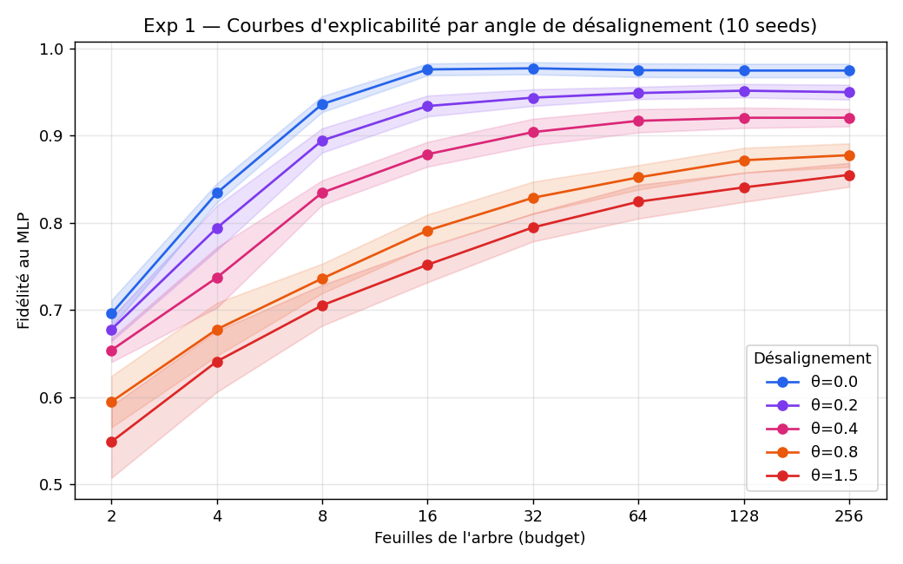
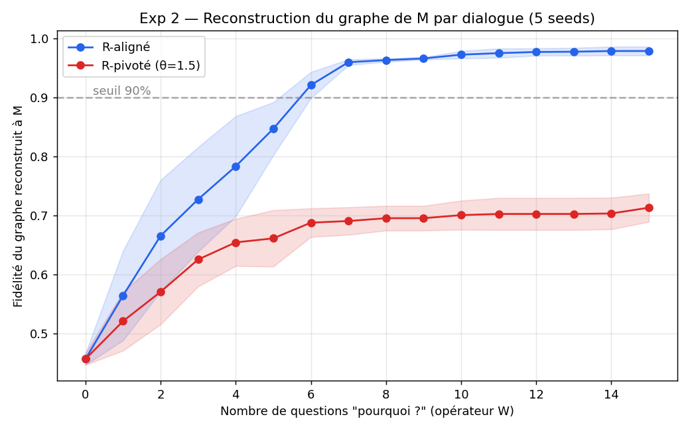
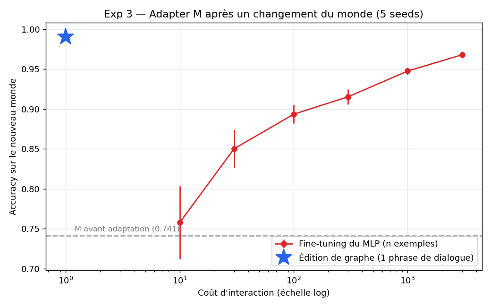

# Relational Explainability (REX)

**L'explicabilité n'est pas une propriété du modèle : c'est une propriété de la relation entre un modèle M et un récepteur R.** On la mesure (courbes d'explicabilité, protocole de questions « pourquoi »), et le même canal sert à corriger le modèle en une phrase (opérateur d'édition W⁻¹).

La XAI classique (SHAP, LIME, arbres de substitution) est le cas dégénéré où les bases représentationnelles de M et de R sont supposées identiques. Ce projet formalise le cas général — Expl(M, R, Q, ε) — et le démontre expérimentalement.

## Les 3 résultats clés (monde synthétique, vérité terrain explicative connue)

**1. Le coût d'explicabilité croît de façon monotone avec le désalignement des bases.**
Même modèle (pas un poids ne change), même information (les rotations sont des bijections) : seule la base du récepteur varie. AUC de fidélité : **0.918** (base alignée, θ=0) → **0.745** (θ=1.5). Budget pour 95 % de fidélité : 16 feuilles en base alignée, jamais atteint (>256) dès θ≥0.4.



**2. L'explication est un protocole interactif mesurable : le nombre de questions « pourquoi ».**
En base alignée, ~6 questions W reconstruisent M à 92 % de fidélité (97.9 % à 15 questions). En base désalignée (θ=1.5), le dialogue ne converge pas (plafond ~71 %) — **avec les mêmes réponses de M**.



**3. Le canal d'explication fonctionne dans les deux sens : 1 phrase d'édition > 3000 exemples de fine-tuning.**
Après un concept drift, l'édition du graphe par une phrase (« quand forme > 0.7, c'est A maintenant ») atteint **0.990** d'accuracy ; le fine-tuning sur 3000 exemples plafonne à 0.968. L'édition est instantanée, traçable, et **locale par construction** : pas d'oubli catastrophique possible.



Deux résultats de structure complètent le tableau : le coût d'explicabilité est invariant aux déformations monotones coordonnée-par-coordonnée de la base (ce qui coûte, c'est le *mélange* des dimensions — Exp 1b), et l'explicabilité dépend de la question contrastive posée, de façon asymétrique (2.95 à 6.39 prédicats selon Q — Exp 4).

## Structure du dépôt

```
/paper          Sources LaTeX du preprint arXiv (en cours)
/experiments    Les 4 expériences reproductibles (seeds fixées)
/figures        Figures des expériences
/core           rex/ — la librairie : RuleListModel, W, W⁻¹, métriques
/tests          Tests unitaires de /core (dont l'invariant de localité de l'édition)
/data           Scripts de téléchargement UCI (aucune donnée commitée)
/docs           Article source, stratégie, document de handoff
```

## Installation et reproduction

```bash
pip install -r requirements.txt

# Reproduire les expériences (chaque script régénère ses résultats de zéro)
python experiments/exp1_solid.py      # Exp 1  : désalignement → coût d'explicabilité
python experiments/exp2.py            # Exp 2  : opérateur W, dialogue actif
python experiments/exp3.py            # Exp 3  : opérateur W⁻¹ vs fine-tuning
python experiments/exp1b_exp4.py      # Exp 1b : non-linéaire ; Exp 4 : dépendance à Q

# Tests de la librairie
python -m pytest tests/
```

La librairie s'utilise directement :

```python
import sys; sys.path.insert(0, "core")   # ou : pip install -e core
from rex import RuleListModel, extract_rule, edit_where, fidelity_curve
```

## Statut

Position paper en préparation (voir `docs/article_source_explicabilite.md` et `docs/STRATEGIE.md`). Prochaine étape scientifique : validation sur données réelles (German Credit / Heart Disease, vocabulaire expert vs features brutes) — le critère go/no-go du projet.

## Licence et citation

Apache-2.0. Voir `CITATION.cff` pour citer ce travail.
